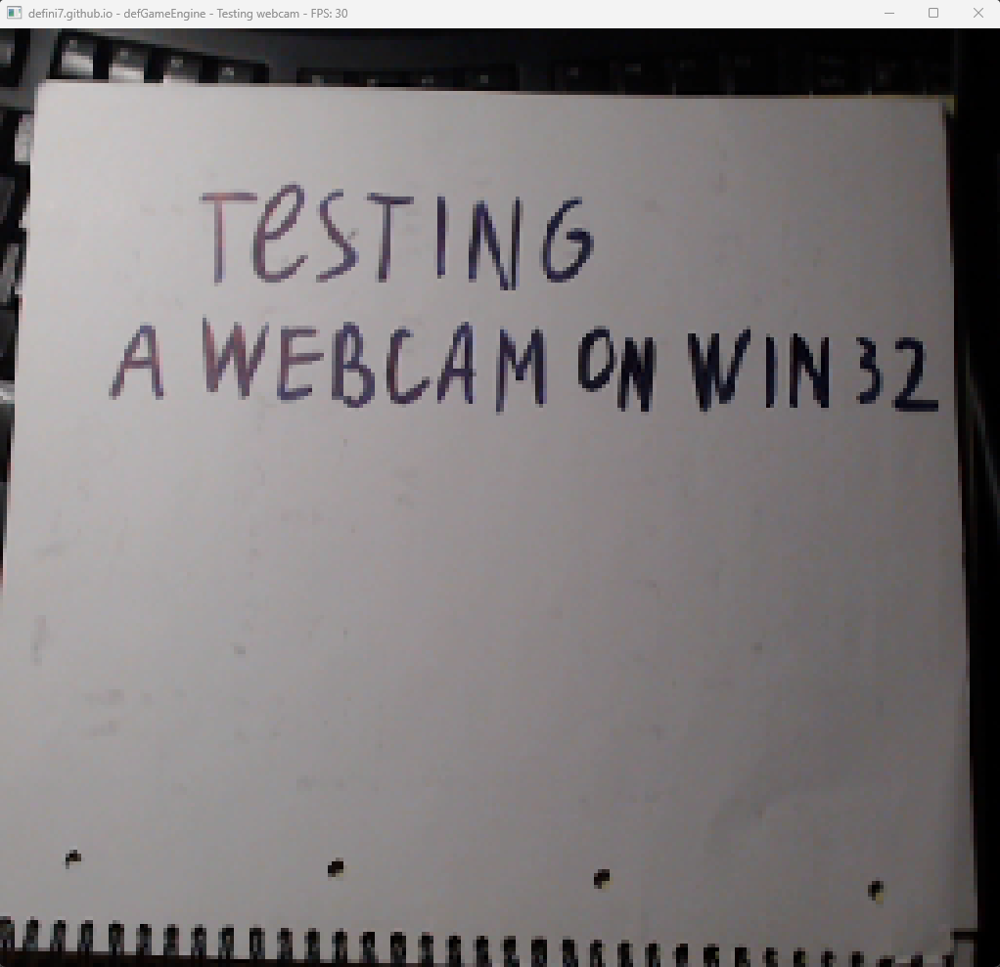

# WWCCAPI

# Why?
The idea was to bring a trivial API for capturing video from a webcam.

# Features
- Supports multiple video formats: RGB32, RGB24, YUY2,
- Capturing video at all available FPSs on your webcam (up to 30),
- Choosing a custom resolution for frames,
- Enumerating all webcams connected to your device.

# Limitations
- Everything is in a sync mode,
- Only one device is supported at once.

# Usage
- Create an instance of **wwcc::Capturer**
- Call **wwcc::Capturer::Init** providing *device id*, *capture width*, *capture height* and *fps*
- Allocate memory for your buffer of **uint32_t** (must be at least `(capture width) * (capture height) * sizeof(uint32_t)`)
- Call **wwcc::Capturer::SetBuffer** providing your buffer
- Call **wwcc::Capturer::DoCapture** to capture one frame (it stops current thread until done)
- Each pixel is stored within a **uint32_t** value in *RGBA* format
