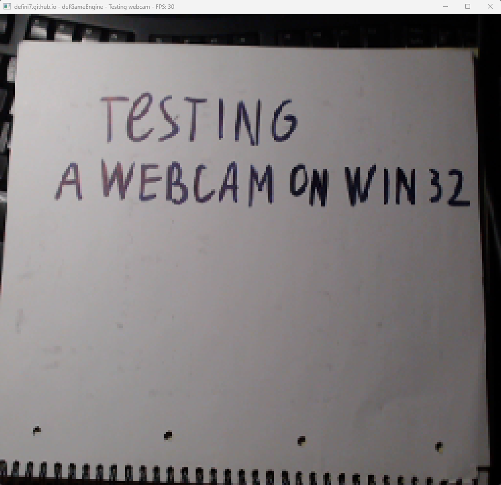
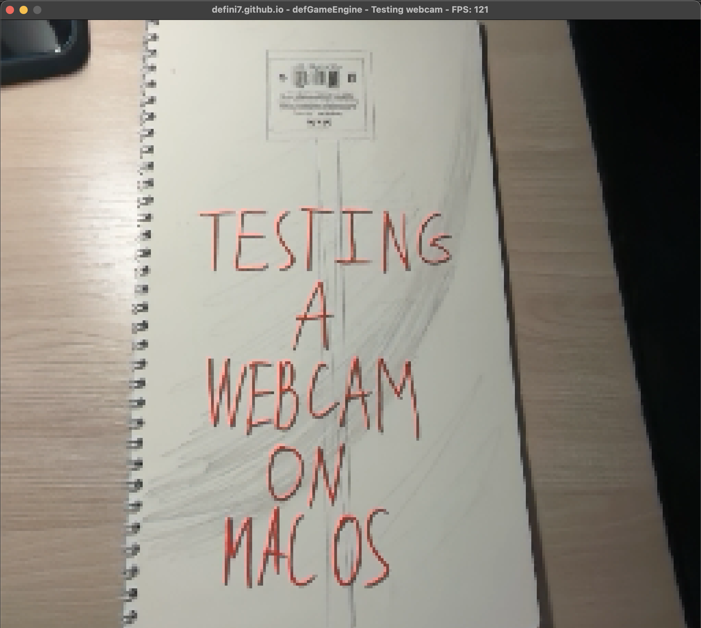

# WCCAPI - WebCam Capturing API

# Why?
The idea was to bring a trivial API for capturing video from a webcam.

# Features
- Supports multiple video formats: RGB32, RGB24, YUY2 - 
that's actually only useful on Windows because of the way how **mfapi** works,
- Capturing video at all available FPSs on your webcam (up to 30),
- Choosing a custom resolution for frames,
- Enumerating all webcams connected to your device.

# Limitations
- On Windows capturing is performed in a sync mode,
- Only one device is supported at once,
- Works only on Windows and macOS.

# Future
- Add Linux support.

# Usage

## Windows

- Create an instance of the **wwcc::Capturer**
- Call **wwcc::Capturer::Init** providing *device id*, *capture width*, *capture height* and *fps*
- Allocate memory for your buffer of **uint32_t** (must be at least `(capture width) * (capture height) * sizeof(uint32_t)`)
- Call **wwcc::Capturer::SetBuffer** providing your buffer
- Call **wwcc::Capturer::DoCapture** to capture one frame (it stops current thread until done)

## macOS

- Create an instance of the **mwcc::CaptureParams**
- Call **mwcc::Init** providing *device id*, *capture width*, *capture height* and *fps*
- Allocate memory for your buffer of **uint32_t** (must be at least `(capture width) * (capture height) * sizeof(uint32_t)`)
- Call **mwcc::SetBuffer** providing your buffer
- Call **mwcc::DoCapture()** to capture one frame (it runs asynchronously)

### Notice
Compile it as an Objective-C++ code

## General
- Each pixel is stored within a **uint32_t** value in the *RGBA* format